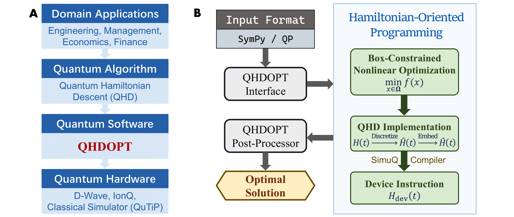

[](https://pubsonline.informs.org/journal/ijoc)

# QHDOPT: A Software for Nonlinear Optimization with Quantum Hamiltonian Descent

This archive is distributed in association with the [INFORMS Journal on
Computing](https://pubsonline.informs.org/journal/ijoc) under the [BSD 3-Clause License](LICENSE.txt).

The software and data in this repository are a snapshot of the software and data
that were used in the research reported on in the paper 
[``QHDOPT: A Software for Nonlinear Optimization with Quantum Hamiltonian Descent''](https://doi.org/10.1287/ijoc.2024.0587) by S. Kushnir, J. Leng, Y. Peng, L. Fan, and X. Wu. 
The snapshot is based on 
[this SHA](https://github.com/jiaqileng/QHDOPT/tree/0f1aec6d1ed83a446fca01f5d23ad1edb7ecdc36) 
in the main repository. 

**Important: This code is being developed on an on-going basis at 
https://github.com/jiaqileng/QHDOPT. Please go there if you would like to
get a more recent version or would like support**

## Cite

To cite the contents of this repository, please cite both the paper and this repo, using their respective DOIs.

https://doi.org/10.1287/ijoc.2024.0587

https://doi.org/10.1287/ijoc.2024.0587.cd

Below is the BibTex for citing this snapshot of the repository.

```
@misc{kushnir2024qhdopt,
  author    = {Kushnir, Sam and Leng, Jiaqi and Peng, Yuxiang and Fan, Lei and Wu, Xiaodi},
  publisher = {{INFORMS Journal on Computing}},
  title     = {{QHDOPT}: A Software for Nonlinear Optimization with {Q}uantum {H}amiltonian {D}escent},
  year      = {2024},
  doi       = {10.1287/ijoc.2024.0587.cd},
  url       = {https://github.com/INFORMSJoC/2024.0587},
  note      = {Available for download at https://github.com/INFORMSJoC/2024.0587},
}
```

## Description

**QHDOPT** (QHD-based OPTimizer) is a software package for nonlinear optimization.

QHDOPT implements a quantum optimization algorithm named [Quantum Hamiltonian Descent](https://jiaqileng.github.io/quantum-hamiltonian-descent/) (QHD) on available quantum computers (such as the [D-Wave systems](https://www.dwavesys.com/)). QHD is a quantum-upgraded version of gradient descent (GD). Unlike the classical GD, QHD demonstrates a significant advantage in solving nonconvex and nonlinear optimization problems.

<p align="center">

</p>

## Installation

QHDOPT has a dependency on Ipopt. You may install Ipopt in your conda environment by

```bash
conda install -c conda-forge cyipopt==1.3.0
```

To install QHDOPT, you can directly install with `pip` by

```bash
pip install qhdopt
```

If you prefer to install from sources, clone this repo and install by

```bash
git clone https://github.com/jiaqileng/QHDOPT.git
cd QHDOPT/
pip install ".[all]"
```

## Usage

Two example notebooks for a jump start are `examples/1_quadratic_programming.ipynb` and `examples/2_nonlinear_programming.ipynb`. The following illustrates the basic building blocks of QHDOPT and their functionalities briefly.

Import QHDOPT by running

```python
from qhdopt import QHD
```

You can create a problem instance by directly constructing the function via SymPy.

```python
from sympy import symbols, exp

x, y = symbols("x y")
f = y**1.5 - exp(4*x) * (y-0.75)
model = QHD.SymPy(f, [x, y], bounds=(0,1))
```

Then you need to setup the solver and the backend device (D-Wave in this example).

```python
model.dwave_setup(resolution=8, api_key="API_key")
```

Here `resolution` represents the resolution of the QHD algorithm, and `api_key` represents the API key of the D-Wave account obtained at [D-Wave Leap](https://cloud.dwavesys.com/leap/).

Now you can solve the target problem.

```python
minimum = model.optimize()
```

The minimal value of $f$ found by QHDOPT is then stored in `minimum`. To print more details in the process, you can run `model.optimize(verbose=1)`.

## Comparison with Existing Tools

We have designed a benchmark test to evaluate the performance of QHDOPT for nonlinear and nonconvex optimization problems. The methodology of the benchmark test is detailed in Section 6 of our paper. 

All the problem instances, experiment setup, and the results can be found in `examples/3_benchmark_testing.ipynb`. We use BARON to find the global optimal solutions of the test problems, see `examples/baron_experiment.ipynb`. 

## Ongoing Development

This code is being developed on an on-going basis at the author's
[Github site](https://github.com/jiaqileng/QHDOPT).

## Support

For support in using this software, submit an
[issue](https://github.com/jiaqileng/QHDOPT/issues/new).
